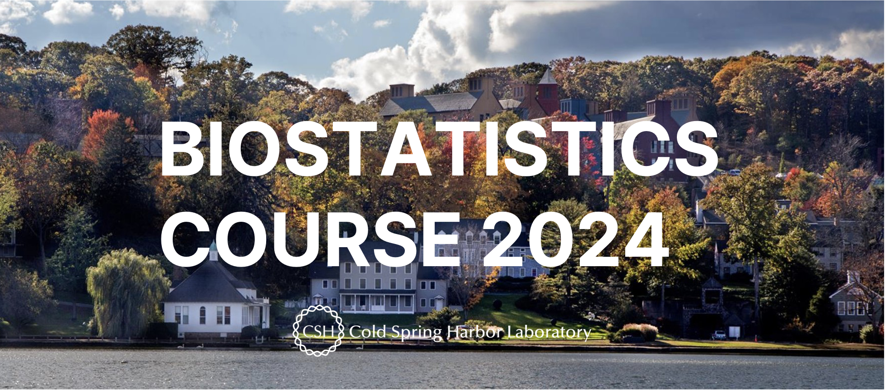
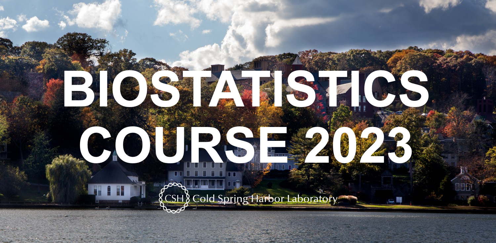

   

<link rel="stylesheet" href="styles.css" type="text/css">
<link rel="stylesheet" href="site_libs/academicons-1.9.1/css/academicons.min.css"/>

### Biostatistics Course 2024 (July, 2024)

 

 

If you click the link, you can go to the [Biostatistics Course 2024 website](http://taehoonh.me/CSHLbiostat2024/index.html).

   

### Biostatistics Course 2023 (July, 2023)

 

 

If you click the link, you can go to the [Biostatistics Course 2023 website](http://taehoonh.me/CSHLbiostat2023/index.html).

   