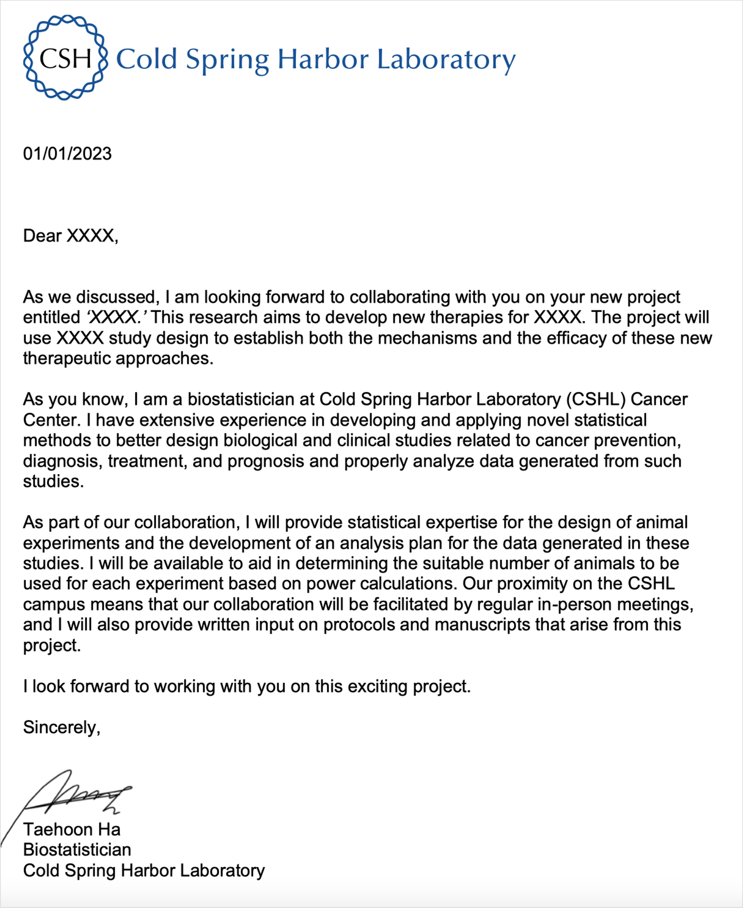
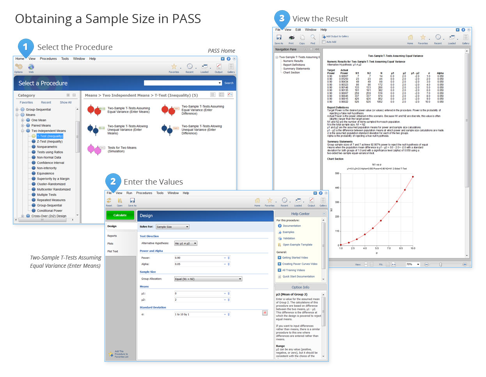

   

<!-- 
 -->
<!--  -->
<!-- 
 -->

> Are you in need of expert biostatistical support for your grant submission? Our comprehensive services are designed to enhance your research proposal, ensuring it stands out in a competitive funding landscape. Here’s what we offer:

 

### Biostatistics Support Letter

A strong support letter from a biostatistician can significantly bolster your grant application. Our biostatistician will provide a detailed letter that outlines the statistical methodologies, data analysis plans, and the significance of biostatistical input in your study. This letter demonstrates the robustness of your research design and the credibility of your lab. For an example of a biostatistics support letter, please see the attached image below:

 

 
[Biostatistics Support Letter Example]

 

### Study Design Review

A well-structured study design is crucial for a successful grant application. Our biostatistician will thoroughly review your study design, offering insights and suggestions to optimize it. This includes refining your research hypotheses, selecting appropriate statistical methods, and ensuring the overall coherence of your study plan.

 

### Power Calculation and Sample Size Justification

Determining the right sample size is essential for achieving valid and reliable results. We will conduct rigorous power calculations to ensure your study is adequately powered to detect meaningful effects. Our team will also provide a detailed justification for the chosen sample size, which is a critical component of your grant proposal.

 

 
[Power Analysis Report Example]

 

### Biosketch

Certain funding organizations, such as the National Insitute of Health (NIH), require a biosketch – a detailed resume of the biostatistician involved in your project. If needed, we will the biostatistician's biosketch. These biosketches will highlight the biostatistician's expertise, qualifications, and key contributions, demonstrating the biostatistician's critical role in your proposed research.

