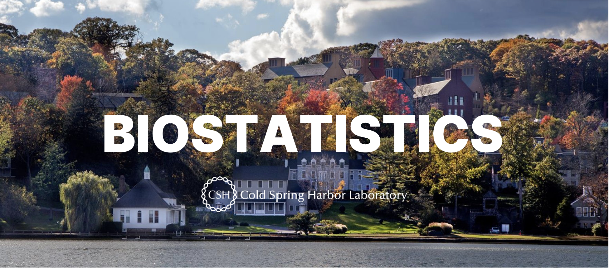

  

 

**Overview**

Welcome to the Biostatistics Core at CSHL, where we are dedicated to enhancing the research quality and output of our faculty, staff, and students. Offering a broad spectrum of statistical consulting services, we are equipped with advanced tools like R, Python, and the latest PASS 2024 software to ensure versatile and capable support for all your statistical needs.

Our services include assistance in study design and power calculations, selection and application of appropriate statistical methods, comprehensive data analysis, customized statistical model development, and data visualization and presentation. Whether you need help designing a study, analyzing data, or creating compelling visual representations, Biostatistics Core is here to support your research endeavors.

 

 